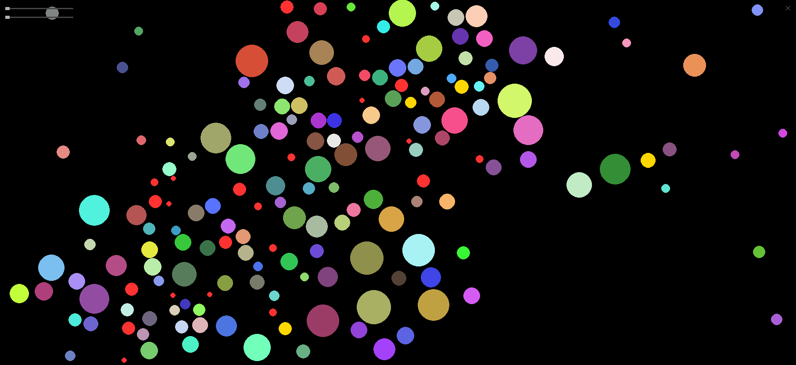

# PyphysicsBall 🎯

A physics-based ball simulation sandbox built with Pygame, featuring realistic physics interactions and engaging gameplay mechanics.




## 🎮 Features

- **Realistic Physics**: Implements gravity, elastic collisions, and momentum conservation
- **Interactive Controls**:
  - Left-click to spawn or drag balls
  - Right-click to toggle force field (push/pull)
  - Double-click to clear an area
- **Special Effects**:
  - Golden balls that explode on impact
  - Ball merging with visual feedback
  - Dynamic color changes based on merges
- **Dynamic Spawning System**: Automatic ball generation with size variations

## 🚀 Installation

1. Clone the repository:
```bash
git clone https://github.com/CNMengHan/PyphysicsBall.git
cd PyphysicsBall
```

2. Install required dependencies:
```bash
pip install pygame
```

3. Run the game:
```bash
python main.py
```

## 🎯 How to Play

- **Spawn Balls**: Left-click anywhere on the screen
- **Drag Balls**: Click and hold on any ball to drag it
- **Force Field**: 
  - Hold right-click to activate force field
  - Right-click once to toggle between push/pull modes
- **Clear Area**: Double-click to remove balls in the vicinity
- **Watch for Special Balls**: Golden balls will explode on impact with the ground

## 🛠️ Technical Details

- Built with Python 3.6+ and Pygame 2.0+
- Implements custom physics engine with:
  - Velocity-based movement
  - Gravity simulation
  - Elastic collision detection
  - Mass-based interactions
  - Force field mechanics

## 🤝 Contributing

Contributions are welcome! Please feel free to submit a Pull Request.

1. Fork the repository
2. Create your feature branch (`git checkout -b feature/AmazingFeature`)
3. Commit your changes (`git commit -m 'Add some AmazingFeature'`)
4. Push to the branch (`git push origin feature/AmazingFeature`)
5. Open a Pull Request

## 📝 License

This project is licensed under the MIT License - see the [LICENSE](LICENSE) file for details.

## 🙏 Acknowledgments

- Pygame community for the excellent gaming framework
- Physics simulation inspiration from various open-source projects

## 📞 Contact

张梦涵 - [@CNMengHan](https://github.com/CNMengHan)

Project Link: [https://github.com/CNMengHan/PyphysicsBall](https://github.com/CNMengHan/PyphysicsBall)
